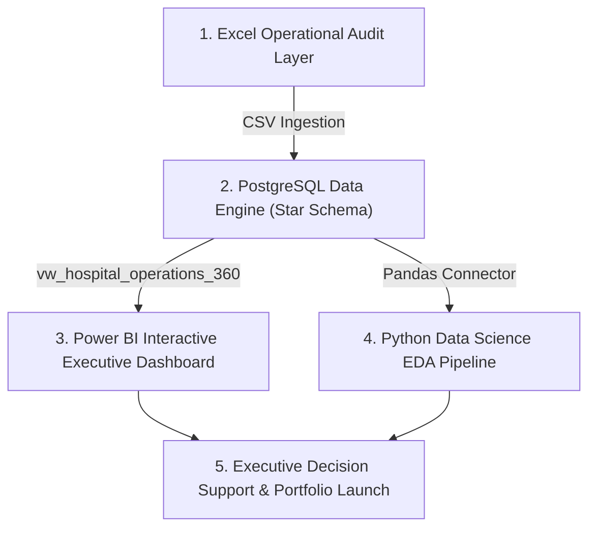

# 🏥 MaxCare Healthcare 360° Operational & Payout Intelligence Suite


## 📌 Executive Summary
**MaxCare Healthcare 360°** is an enterprise-grade, 4-tier analytics system engineered to analyze hospital clinical operations, patient financial spend, insurance claim payouts, and doctor productivity across **1,000 patient records**.

The suite addresses two critical healthcare business challenges:
1. **Payment Realization & Audit Integrity:** Automated tracking of pending invoices (`Pending` ➔ `Paid`) via PostgreSQL audit triggers.
2. **Clinical Resource Efficiency:** Ranking doctor performance per department using SQL window functions (`DENSE_RANK`) and evaluating length-of-stay distributions using Python Seaborn EDA.

---

## 📐 Enterprise 4-Tier System Architecture



---

## 🛠️ Technical Implementation Across Layers

### 1️⃣ Layer 1: Excel Operational Audit
- Cleaned and audited 1,000 patient records.
- Computed key audit formulas: `Length_Of_Stay_Days` (`Discharge_Date - Admission_Date`), `Insurance_Claim_Pct`, and `Out_Of_Pocket_Pct`.
- Generated initial department pivot summaries.

### 2️⃣ Layer 2: PostgreSQL Data Engine & Star Schema
- **Data Modeling:** Modeled a 4-table Star Schema (`Dim_Patients`, `Dim_Doctors`, `Fact_Appointments`, `Fact_Billing`).
- **Performance Indexing:** Implemented selective B-Tree indexes (`idx_patients_city`, `idx_doctors_dept`, `idx_billing_status`) for sub-second query speeds.
- **Audit Trigger:** Created automated compliance trigger `trg_audit_billing_status` logging status modifications (`Pending` ➔ `Paid`) into `Audit_Logs`.
- **Advanced Analytics:** Applied `DENSE_RANK()` for departmental doctor rankings, `NTILE(4)` for patient spend quartiles, and CTEs for realization rates.
- **Master View:** Exposed denormalized view `vw_hospital_operations_360` for seamless Power BI & Python integration.

### 3️⃣ Layer 3: Power BI Interactive Executive Dashboard
- **3-Page Suite:** Executive Overview, Financial Payouts & Insurance, and Clinical Doctor Leaderboard.
- **DAX Metrics:** Developed custom measures (`Total Admissions`, `Total Revenue`, `Insurance Coverage Pct`, `Payment Realization Rate`, `Avg Stay Days`).
- **User Interface:** High-contrast Dark Midnight Executive UI with rounded glassmorphism containers and live interactive Department & City slicers.

### 4️⃣ Layer 4: Python Data Science & Seaborn Visual EDA
- **Library Stack:** `Pandas`, `NumPy`, `Matplotlib`, `Seaborn`.
- **Statistical Graphics Generated:**
  - `python_eda_heatmap_correlation.png`: Correlation heatmap between age, stay days, treatment cost, and insurance coverage (`+0.98` correlation).
  - `python_eda_boxplot_department.png`: Departmental treatment cost spread and median boxplots.
  - `python_eda_stay_distribution.png`: Length-of-stay KDE bell curve distribution with average line indicator (8.3 Days).

---

## 📊 Key Business Findings & Impact

| Metric Name | Value | Executive Insight |
| :--- | :--- | :--- |
| **Total Treatment Revenue** | **₹11.06 Crore** | Total billing across 1,000 patient admissions |
| **Insurance Claim Cover** | **72.0% (₹7.96 Cr)** | 72% of total hospital revenue covered via insurance claims |
| **Out-Of-Pocket Share** | **28.0% (₹3.09 Cr)** | 28% patient self-pay ratio |
| **Payment Realization Rate** | **82.35%** | 824 cleared invoices | 176 pending audit clearance |
| **Avg Hospital Stay** | **8.3 Days** | Cardiology & Neurology registered highest stay durations |

---

## 📁 Repository Directory Structure

```text
Healthcare_Analytics_Project/
│
├── MaxCare_Hospital_1000_Patients.csv        # Raw Dataset (1,000 Records)
├── MaxCare_Healthcare_Excel_Audit.xlsx        # Phase 1: Excel Audit File
├── step2_3_healthcare_ingestion.sql           # Phase 2: PostgreSQL Data Ingestion
├── step2_4_healthcare_analytics.sql           # Phase 2: SQL Window Functions & Views
├── MaxCare_Healthcare_360_PowerBI_Dashboard.pbix # Phase 3: Power BI Dashboard
├── 04_healthcare_eda_pipeline.py              # Phase 4: Python Visual EDA Pipeline
├── python_eda_heatmap_correlation.png          # Generated Seaborn Correlation Chart
├── python_eda_boxplot_department.png          # Generated Seaborn Boxplot Chart
├── python_eda_stay_distribution.png           # Generated Seaborn Distribution Chart
└── README.md                                  # Project Documentation
```

---

## 👩‍💻 Author & Contact Information
**Khyati Rajput**  
*B.Tech Computer Science & Engineering (Final Year)*  
*AKTU / RVIT (2023–2027 Batch)*  
- 💼 **LinkedIn:** [linkedin.com/in/khyati-rajput](https://linkedin.com)
- 🐙 **GitHub:** [github.com/khyati-rajput](https://github.com)
- 📧 **Email:** rajputkhyati@gmail.com
